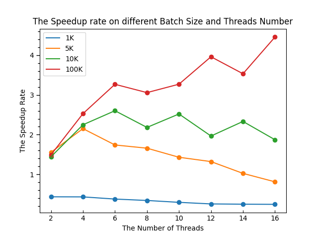
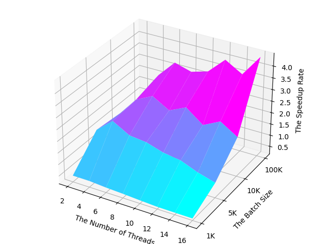
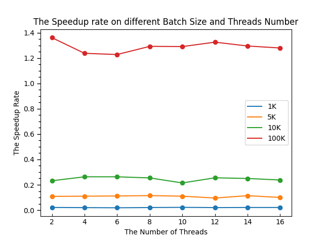
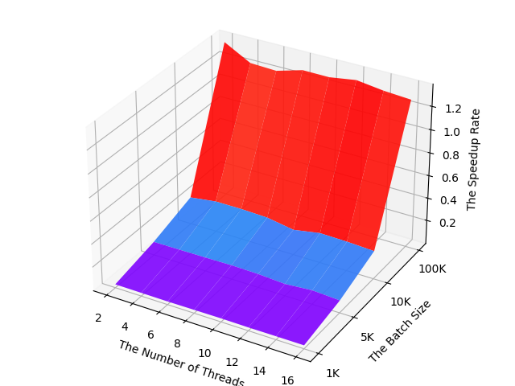

# 并行分布式计算课程设计——必做部分（三选二）   
&emsp;&emsp;并行分布式计算必选项目提供三个选题，需要从中选择两个来实现。这里选择前两个，具体而言分别是基于 `OpenMP` 实现 **快速排序的并行化**，与基于 `MPI` 实现 **正则采样排序（PSRS）**。  
  
## 1. 多线程并行快速排序算法  
### 1.1 任务描述  
&emsp;&emsp;`OpenMP` 属于 **共享变量** 的编程类型，通过 **编译指导语句** 实现共享内存环境（多线程）下的程序并行，我们需要编写程序并测试其在 **不同数据量**（1K、5K、10K、100K）以及 **不同线程数**（2，4，6 ... 16）情况下的加速比。  

### 1.2 运行环境  
- 操作系统：Windows 10
- 处理器：AMD Ryzen 7 5800H with Radeon Graphics, 3.20 GHz
- 内存：16.0 GB (13.9 GB 可用)
- 核数：8  

### 1.3 核心代码  
### 1.3.1 串行快排  
&emsp;&emsp;快速排序总体分为两步，一是选择 **轴点（pivot）** 并根据大小比较将数组进行分割，二是对两个子数组 **递归地调用算法** 。值得一提的是，为了防止特殊数据分布（如接近倒序或接近正序）带来的性能下降，采用 **随机化思想**，随机地选取轴点。    
  
### 1.3.2 并行快排  
&emsp;&emsp;一个非常自然的想法就是 **并行执行两个子程序**，具体到代码而言，使用 `OpenMP` 中的 `task` 语句。这一指令将创建一个任务，并从其所在的 **线程池** 中获取线程来执行，十分适合对于递归调用的并行化，下面是代码实现，只需要在串行代码中加入部分编译指导语句即可，十分符合 `OpenMP` 的 **设计哲学**：  
- `main` 函数中指定线程池大小（即线程数量）  
```C++
#pragma omp parallel num_threads(threads_num)
{
    #pragma omp single
    Sort_para(nums2, 0, n, cutoff);
}
```  
&emsp;&emsp;其中，`threads_num` 为用户指定的线程数，我们需要分别取2，4...16进行测试。`cutoff` 为截尾阈值，因为按照 **分治设计技术** 进行并行程序设计的时候，随着递归的深入，所需线程数将呈 **指数级的增长**，由于线程的设立与销毁本身也需要一定的 **时空代价**，于是在递归进行到一定深度的时候我们可以 **改用串行执行**。具体而言，我们指定当 **待排序数组的长度** 降低到 `cutoff` 大小时，不再开设新线程。    

- `task` 语句并行执行递归子程序  
```C++
// 递归排序子数组，如果已经递归比较深，改用串行
if(end - begin <= cutoff){
    QS_seq(nums, begin, pivot_pos);
    QS_seq(nums, pivot_pos + 1, end);
    return;
}
#pragma omp task shared(nums)
QS_para(nums, begin, pivot_pos, cutoff);
#pragma omp task shared(nums)
QS_para(nums, pivot_pos + 1, end, cutoff);        

#pragma omp taskwait
```  
&emsp;&emsp;代码的自解释能力很强，唯一注意的点在于，由于我们采用 **原地排序** 的方法，不同线程之间需要共享 `nums` 数组。  

### 1.4 实验结果  
### 1.4.1 正确性检验  
&emsp;&emsp;为保证并行算法的正确性，我们需要进行正确性检验，方法是 **差分测试**，将并行排序的结果与可信任的串行排序结果进行比对。通过 **断言** 来得到测试结果，只有在断言通过后才会 **写入日志**。  

### 1.4.2 加速比测算   
&emsp;&emsp;通过 `C++11` 中的时间库 `std::chrono` 来进行时间测量，单位为毫秒(ms)。分别测量串行排序的时间 `seq_time` 与并行排序的时间 `para_time`，加速比计算公式为 $speedup=\frac{seq\_ time}{para\_ time}$，具体数据见 `QuickSort_OMP/Results/Result_TXXX.log`，其中 `XXX` 为具体数字，表示 **使用的线程数**。对于 **加速比** ，绘制表格如下：  
| 使用线程数   \  数据集大小 | 1K|5K|10K|100K|
|-----|------|------|------|------|      
| 2   |  0.437722    |1.55644|1.44414|1.49363|
| 4   |   0.435897  |2.15209|2.24877|2.52854|
| 6   |   0.381148   |1.74106| 2.60217|3.26646|
| 8   |    0.345865  |1.66045|2.18235|3.05748|
| 10   |   0.298755  |1.4321|2.52049|3.26933|
| 12   |    0.258982  |1.32342|1.9658|3.9589|
| 14   |   0.252366   |1.02671|2.33281|3.53175|
| 16   |    0.248304  |0.81451|1.87243|4.45449|

&emsp;&emsp;绘制折线图与三维曲面图如下：  
<div style="text-align:center;">


</div>

&emsp;&emsp;接下来，我们对于实验数据进行分析与解释：

- **数据集大小**  
&emsp;&emsp;数据集大小分别取 1K，5K，10K 和 100K，折线图中每 **一条折线**、曲面图中的 **x轴** 代表一种数据集大小。可以看到在数据集大小仅有1K时，并行算法的效率甚至远不如串行算法。但是在数据集增大到 5K 或更多时，加速比 **显著上升**，并开始呈现 **对串行算法的优越性**。究其原因，可能与 **线程并行开销** 与 **实际计算开销** 之间的权重比较相关。在数据集很小的时候，实际 **计算上节省的时间** 甚至不如 **线程本身所带来的额外开销**，于是便导致并行算法反而不如串行算法。总体而言，随着数据集规模的增长，加速比 **始终保持提升**。  

- **线程数**  
&emsp;&emsp;可以看到，加速比并不总是随着线程数的增大而升高。在数据集较小的情况下，随着线程数的增大，加速比呈现 **先升后降甚至不断下降** 的趋势，对于不同的数据集大小，**最高加速比** 在线程数为 4, 6, 16 的时候都有可能出现。其原因上文已经分析过，具体而言，线程带来的额外开销可能有如下几个方面：  
    - **建立与销毁线程** 本身的时空开销
    - **线程间的同步** 所带来的开销
    - **线程间上下文切换** 所带来的开销  
    - 在 **线程数超过核数** 的时候，可能出现的伪并行  

## 2. 内存不共享多机环境下并行正则采样排序算法（PSRS）  
### 2.1 任务描述  
&emsp;&emsp;使用 `MPI` 实现 `Parallel sorting by regular sampling` 算法，并测试程序在1K、5K、10K、100K等 **不同数据量** 以及在 **不同线程数** 情况下的加速比。  
### 2.2 运行环境  
- 操作系统：Windows 10
- 处理器：AMD Ryzen 7 5800H with Radeon Graphics, 3.20 GHz
- 内存：16.0 GB (13.9 GB 可用)
- 核数：8  

&emsp;&emsp;在 `Windows` 上使用 `MPI` 需下载 **官方代码库** 并配置执行环境。算法使用进程数需由 **执行时的命令行参数** 指定。  
### 2.3 核心代码  
### 2.3.1 算法流程  
&emsp;&emsp;`PSRS` 是重要的并行排序算法之一，适用于 **内存不共享多机** 环境，`MIMD` 模型。假设有 $p$ 个处理器，对数组 $A$ 进行排序，则算法流程如下：  
- **均匀划分**：将n个元素 $A[1..n]$ 均匀划分成 $p$ 段，每个 $p_i$ 处理 $A[\frac{(i-1)n}{p}+1\dots \frac{in}{p}]$
- **局部排序**：$p_i$ 调用串行排序算法对 $A[\frac{(i-1)n}{p}+1\dots \frac{in}{p}]$ 排序
- **选取样本**：$p_i$ 从其有序子序列 $A[\frac{(i-1)n}{p}+1\dots \frac{in}{p}]$ 中选取 $p$ 个样本元素
- **样本排序**：用一台处理器对 $p^2$ 个样本元素进行串行排序
- **选择主元**：用一台处理器从排好序的样本序列中选取 $p-1$ 个主元，并播送给其他 $p_i$ 
- **主元划分**：$p_i$ 按主元将有序段 $A[\frac{(i-1)n}{p}+1\dots \frac{in}{p}]$ 划分成 $p$ 段
- **全局交换**：各处理器将其有序段按段号交换到对应的处理器中
- **归并排序**：各处理器对接收到的元素进行归并排序

### 2.3.2 代码实现  
&emsp;&emsp;`MPI` 的使用有一定的规范，从 `MPI_init(&argc, &argv)` 初始化开始，到 `MPI_Finalize()` 释放资源结束，而且一个程序 **只能有一次** 初始化的过程。均匀划分后，主进程使用 `MPI_Scatterv()` 进行数据分发，需要显式对数据进行划分，指定各分段的 **偏移量** 与 **数据长度**；在各进程选取好样本之后，需使用 `MPI_Gather()` 汇总到主进程进行 **样本排序**；此外，如果主进程播送的是 **完全相同的数据**，也可以直接使用 `MPI_Bcast()` 进行广播；最后，**全局交换** 阶段每一个进程需要向其他各进程播送自己的 **划分结果**，应当使用 `MPI_Alltoallv()` 进行数据交换。  
- **均匀划分**  
&emsp;&emsp;需要注意到的一点是，受限于 **资源数目**，我们并不总能进行均匀划分！当数组长度无法整除可用进程数时，我们需要做出额外的操作，在此次实验中，我们将余数全部堆放至 **最后一个进程** 中。也正是由于这个原因，我们不能使用 `MPI_Scatter()` 而应当使用 `MPI_Scatterv()` 来进行数据分发。均匀划分步骤的代码如下：  
```C++
// 1. 均匀划分

// 计算各块的数据偏移displs与数据量sendcounts
// 将无法整除的余数堆到最后一个进程，该块数据量为block_size_pro
int sendcounts[proc_num];
int displs[proc_num];
for(int i = 0; i < proc_num; ++i){
    displs[i] = i * block_size;
    sendcounts[i] = block_size;
}
sendcounts[proc_num - 1] = block_size_pro;

// 数据接收缓冲区distbuf
int distbuf[block_size_pro];
int* rootbuf = &nums[0];
// 这里数据数量都是单个进程的数量
MPI_Scatterv(rootbuf, sendcounts, displs, MPI_INT, distbuf, block_size_pro, MPI_INT, 0,MPI_COMM_WORLD);
```  

- **局部排序**  
&emsp;&emsp;各进程分别调用C语言库函数 `qsort()` 进行排序，注意区分是否为 `block_size_pro`，如下：  
```C++
// 2. 局部排序
if(proc_id == proc_num - 1)
    qsort(distbuf, block_size_pro, sizeof(MPI_INT), cmp);
else
    qsort(distbuf, block_size, sizeof(MPI_INT), cmp);
```  

- **选取样本**  
&emsp;&emsp;假设有p个进程，则各个进程中选取p个样本，总数为 $p^2$。各进程的样本存放于 `sample` 数组中，并经 `MPI_Gather()` 汇总到主进程的 `samples` 中，如下：  
```C++
// 3. 选取样本
// p个进程每个进程选取p个元素，采样数目等于进程数目
int samples[proc_num * proc_num];
int sample[proc_num];
for(int i = 0; i < proc_num; ++i){
    sample[i] = distbuf[i * block_size / proc_num];
}
MPI_Gather(sample, proc_num, MPI_INT, samples,proc_num, MPI_INT, 0, MPI_COMM_WORLD);
MPI_Barrier(MPI_COMM_WORLD);
```

- **样本排序**  
&emsp;&emsp;**主进程** 中，对 $p^2$ 个样本进行排序，直接使用库函数即可，如下：  
```C++
// 4. 样本排序(p^2个)
if(proc_id == 0){
    qsort(samples, proc_num * proc_num, sizeof(MPI_INT), cmp);
}
```  

- **选择主元**  
&emsp;&emsp;同样在 **主进程** 中，在排好序的 $p^2$ 个样本中，选择 $p-1$ 个主元，如下：  
```C++
// 5. 选择主元（p-1个）
int primes[proc_num - 1];
if(proc_id == 0){
    for(int i = 0; i < proc_num - 1; ++i){
        primes[i] = samples[(i + 1) * proc_num];
    }
}
```  

- **主元划分**  
&emsp;&emsp;在各个进程内部，根据上一步选取出来的主元进行 **重新划分**，需要根据是否是 `block_size_pro` 分开处理，不过逻辑是相似的，如下：    

```C++
// 6. 主元划分

// 广播主元
MPI_Bcast(primes, proc_num - 1, MPI_INT, 0,MPI_COMM_WORLD);

// 按照主元重塑各分段，需要区分pro与否
vector<vector<int>> reshapedNums(proc_num,vector<int>());
if(proc_id == proc_num - 1){
    // 外层循环遍历各主元，每次构建一行
    int j = 0;
    for(int i = 0; i < proc_num - 1; ++i){
        int partition_prime = primes[i];
        for(;j < block_size_pro && distbuf[j] < partition_prime; ++j){
            reshapedNums[i].push_back(distbuf[j]);
        }
    }
    // 最后一行
    reshapedNums.back() = vector<int>(block_size_pro - j);
}
else{
    // 外层循环遍历各主元，每次构建一行
    int j = 0;
    for(int i = 0; i < proc_num - 1; ++i){
        int partition_prime = primes[i];
        for(;j < block_size && distbuf[j] < partition_prime; ++j){
            reshapedNums[i].push_back(distbuf[j]);
        }
    }        
    // 最后一行
    reshapedNums.back() = vector<int>(block_size - j);
}
```  

- **全局交换**  
&emsp;&emsp;现在，各进程内部已经将数据按照主元重新分为 $p$ 段，需将第一段发送至进程一，第二段发送至进程二 …… 以此类推。但需要注意到，主元分割之后，各进程只知道要给其他进程 **发送多长的信息**，但不知道自己要 **接收多长的信息**，故在数据交换之前，还需进行数据长度的全局交换，如下：  

```C++
// 7. 全局交换
// send_count[]存储各分段的大小, send_disp[]存储偏移量
int send_count[proc_num];
int send_disp[proc_num];
send_disp[0] = 0;
for(int i = 0; i < reshapedNums.size(); ++i){
    send_count[i] = reshapedNums[i].size();
    if(i < reshapedNums.size() - 1)
        send_disp[i + 1] = send_disp[i] + send_count[i];
}

// 在数据交换之前，还需进行数据长度的全局交换，计算recv_size与recv_count
int recv_count[proc_num];
int recv_disp[proc_num]; recv_disp[0] = 0;
MPI_Alltoall(send_count, 1, MPI_INT, recv_count, 1,MPI_INT, MPI_COMM_WORLD);
// recv_size累加收到数据的总数
int recv_size = recv_count[0];
for(int i = 1; i < proc_num; ++i){
    recv_disp[i] = recv_count[i - 1] + recv_disp[i - 1];
    recv_size += recv_count[i];
}

// 正式交换数据，使用新的缓冲区new_distbuf来接收
int new_distbuf[recv_size];
MPI_Alltoallv(distbuf, send_count, send_disp,MPI_INT, 
    new_distbuf, recv_count, recv_disp, MPI_INT, 
    MPI_COMM_WORLD
);
```

- **归并排序**  
&emsp;&emsp;全局交换结束之后，各进程都收到了 $p$ 个有序数组，只需要将其 **归并排序**，即可得到 **全局有序** 的结果。这里采用的方法是 **迭代地归并** 两个数组（当然，更快的做法是分而治之，不过重点不在算法，而在并行计算），如下：  
```C++
void merge_two(int *array, int begin1, int end1, int begin2, int end2){
    int iter1 = begin1;
    int iter2 = begin2;
    int merged_iter = 0;
    int merged[end1 - begin1 + end2 - begin2];

    while(iter1 != end1 && iter2 != end2){
        if(array[iter1] > array[iter2]){
            merged[merged_iter] = array[iter2];
            merged_iter += 1;
            iter2 += 1;
        }
        else{
            merged[merged_iter] = array[iter1];
            merged_iter += 1;
            iter1 += 1;            
        }
    }
    while(iter1 != end1){
        merged[merged_iter] = array[iter1];
        iter1 += 1;
        merged_iter += 1;
    }
    while(iter2 != end2){
        merged[merged_iter] = array[iter2];
        merged_iter += 1;
        iter2 += 1;   
    }

    // 归回原位
    for(int i = 0; i < merged_iter; ++i){
        array[begin1 + i] = merged[i];
    }
    return;
}

void merge_sort(int *new_distbuf, int *recv_disp, int *recv_count, int n){
    if(n == 1)
        return;

    for(int i = 1; i < n; ++i){
        merge_two(new_distbuf, recv_disp[0], recv_disp[i], recv_disp[i], recv_disp[i] + recv_count[i]);
    }
}
```  

- **收集结果**  
&emsp;&emsp;在最后的最后，我们需要对分布在各进程中的数据进行收集，得到最终的结果。与 **全局交换** 中类似，我们在 **数据的收集** 前需要进行 **数据长度的收集**，如下：  
```C++
// 9. 收集结果
// 各处理器中的元素总数汇报一下，复用recv_count数组
MPI_Gather(&recv_size, 1, MPI_INT, recv_count, 1, MPI_INT, 0, MPI_COMM_WORLD);
recv_disp[0] = 0;
for(int i = 1; i < proc_num; ++i){
    recv_disp[i] = recv_disp[i - 1] + recv_count[i - 1];
}
// 将各处理器的结果汇总到rootbuf中
MPI_Gatherv(new_distbuf, recv_size, MPI_INT,rootbuf, recv_count, recv_disp, MPI_INT, 0, MPI_COMM_WORLD);
```  

### 2.4 实验结果  
### 2.4.1 正确性检验  
&emsp;&emsp;与 [实验一](#14-实验结果) 相同，使用 **断言式** 的检验方法，不再赘述。  

### 2.4.2 加速比测算   
&emsp;&emsp;计算方法与 [实验一](#142-加速比测算) 相同，这里直接列出 **加速比** 的结果：  
| 使用线程数   \  数据集大小 | 1K|5K|10K|100K|
|-----|------|------|------|------|      
| 2   |  0.0208869    |0.108464|0.231822|1.36085|
| 4   |   0.0197712  |0.109981|0.262935|1.23736|
| 6   |   0.0186541   |0.111675| 0.262951|1.22782|
| 8   |    0.0203714  |0.114683|0.254185|1.29232|
| 10   |   0.0219638  |0.110041|0.214571|1.29047|
| 12   |    0.0199474  |0.0955577|0.25509|1.32541|
| 14   |    0.0208228  |0.114015|0.2498|1.2951|
| 16   |   0.0207462   |0.100143|0.237705|1.27943|


&emsp;&emsp;绘制折线图与三维曲面图如下：  
<div style="text-align:center;">


</div>


&emsp;&emsp;根据实验结果，在数据集大小达到 **100K** 时，PSRS算法有了 **质的飞跃**，并终于呈现出了加速效果，此前一直是远低于串行算法。究其原因，除了在实验一提出的种种之外，由于 `MPI` 是内存不共享的模式，于是会多出 **消息传递** 的时间。此外，**进程的开销** 也远大于线程，这也是为什么从直观上来看性能不如实验一的原因之一。  

## 3. 其他辅助代码  
### 3.1 日志调试函数 `Logdebug()`  
&emsp;&emsp;并行编程调试困难，难以使用侵入式的断点调试功能，最便捷的方法是 **加入日志输出**。  
### 3.2 数据读入函数与正确性校验函数 `Utils`  
&emsp;&emsp;在两个必做实验中都需要处理 **数据的读入** 与 **结果正确性的校验**，又由于二者实现的功能均为数组排序，故可以采用统一的辅助函数。数据存储于 `dataset/Data_XXX` 中，`XXX` 表示数据集的规模，实验开始前需将其读入内存中。读入数据步骤与正确性校验步骤都不计入时长。  
### 3.3 自定义日志类 `Log`  
&emsp;&emsp;实验得到的数据需要以 **统一的格式** 记录进日志中，以方便后续作图步骤的 **自动化**，故将日志类进行封装，只需简单调用接口 `write()` 就可实现日志的格式化写入，大大方便了数据记录。  
### 3.4 脚本文件 `draw.sh` 与 `run.sh`  
&emsp;&emsp;并行程序的编译运行指令有固定的格式，有时需要加入 **额外的编译选项**。为防止命令的错误导致实验的异常，针对 **运行** 与 **作图** 两个步骤分别定义脚本文件，使得实验的 **进行与可视化** 变得方便快捷，不易出现程式上的错漏。  
