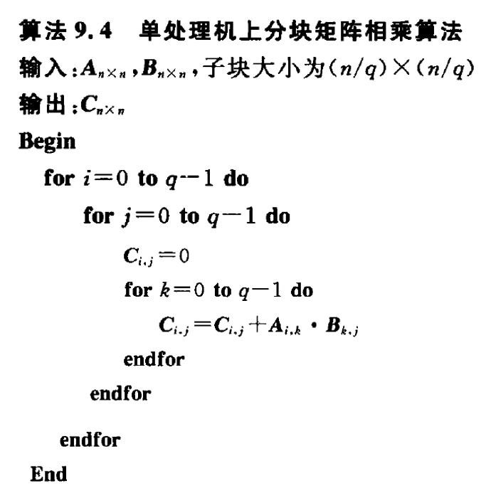
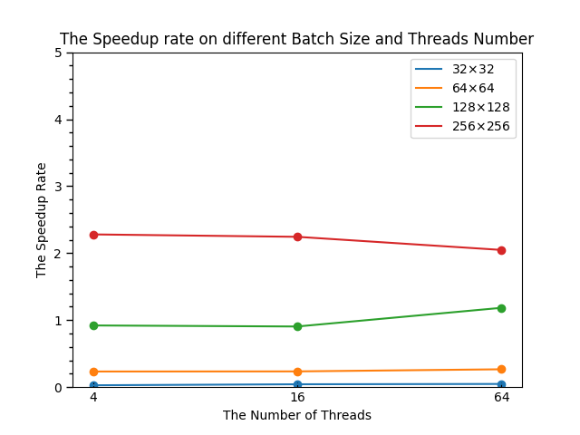
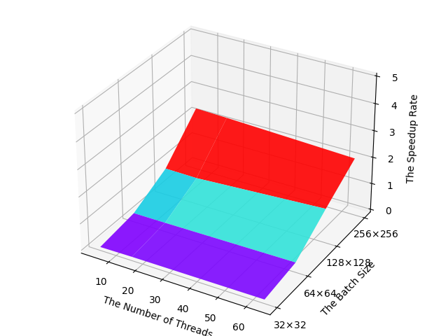
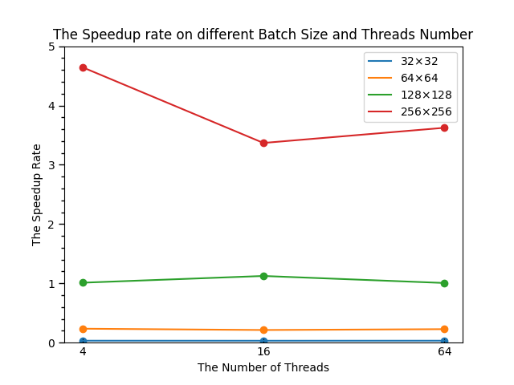
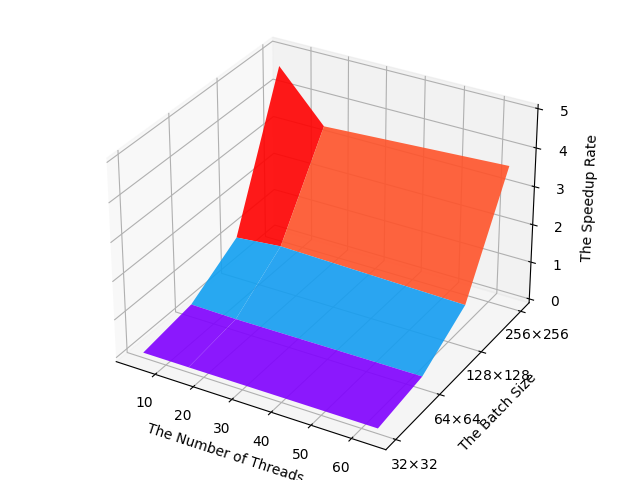

# 并行分布式计算课程设计——选做部分
## 1. 项目描述  
&emsp;&emsp;稠密矩阵相乘的并行化，方法众多。基于课堂所学，这里对于 **简单分块方法** 与 **Cannon 算法** 进行实现，基于消息传递模型 `MPI`。分别将二者与朴素串行矩阵乘法进行对比，并计算加速比。从 **通讯开销**，**存储开销** 等方面对比这两种并行矩阵乘法的方法。    
## 2. 运行环境  
- **操作系统**：Windows 10
- **处理器**：AMD Ryzen 7 5800H with Radeon Graphics, 3.20 GHz
- **内存**：16.0 GB (13.9 GB 可用)
- **核数**：8  
## 3. 实验思路与核心代码  
### 3.1 普通矩阵乘法  
&emsp;&emsp;对于矩阵相乘 $C_{m\times n}=A_{m\times p} \times B_{p\times n}$，根据代数知识需要将 A 矩阵各行乘上 B 矩阵各列并相加得到 C 矩阵，具体而言为：  
$$c_{i,j} = \sum_{k=0}^{p}{a_{i,k} \times b_{k, j}}$$  
&emsp;&emsp;容易知道计算的时间复杂度与 **矩阵的规模** 相关。为了表示方便，不妨假设两个矩阵 A 与 B 均为 $n\times n$ 的矩阵，于是普通的串行矩阵乘法的复杂度为 $O(n^3)$。  

### 3.2 简单并行分块乘法  
&emsp;&emsp;最简单的并行方法就是将矩阵进行 **块状划分**，划分为 $\sqrt{p}\times \sqrt p$ 个块状矩阵 $A_{i,j}, B_{i,j}和C_{i,j}$，大小均为 $\frac{n}{\sqrt{p}}\times \frac{n}{\sqrt{p}}$ 其中 p 为 **可用的处理器数目**。p 个处理器分别编号为 $P_{0,0}, \dots P_{0,\sqrt{p}-1}\dots P_{\sqrt{p}-1,\sqrt{p}-1}$，各个处理器分别存放对应的 $A_{i,j}, B_{i,j}和C_{i,j}$。  
&emsp;&emsp;算法分为 **通讯** 和 **计算** 两个阶段：在通讯阶段，**各行处理器** 进行 A 矩阵的多到多播送，**各列处理器** 进行 B 矩阵的多到多播送，每个处理器发送 $\sqrt{p} -1$ 次，并接收相同个数的子块。注意，由于 **异步传输不保证顺序**，每个结点最坏情况需要将所有收到的结果存储下来，存储总大小为 $O(\frac{n^2}{\sqrt{p}})$ 这对于 **单个处理器的存储** 也是一大挑战；  
&emsp;&emsp;在收到所有的矩阵块后，就可以进入 **计算阶段**，每个处理器 $P_{i,j}$ 将收到的各个矩阵块相乘并相加，得到对应的部分结果 $C_{i,j}$。为了 **结果验证的方便**，在分布式的计算结束后，我们 **额外** 让各个处理器将自己的结果全部发送至 0 号处理器中，算法伪代码描述如下：  
<center>

</center>

### 3.3 Cannon算法  
### 3.3.1 算法描述  
&emsp;&emsp;`Cannon` 算法在 **分解问题** 方面与简单并行分块乘法相同，都采用的是 **分块划分** 的方法，这里不再赘述。与简单分块并行乘法不同的是，`Cannon` 算法不是在通讯结束之后计算，而是 **通讯与计算交替进行**，算法可以非形式化地描述如下：  
1. 所有块 $A_{i,j}(0\le i,j\le \sqrt{p}-1)$向左循环移动 i 步；所有块 $B_{i,j}(0\le i,j\le \sqrt{p}-1)$向上循环移动 j 步；
2. 所有处理器 $P_{i,j}$ 执行 $A_{i,j}$ 和 $B_{i,j}$ 的乘-加运算；
3. A 的每个块向左循环移动一步；B 的每个块向上循环移动一步；
4. 转 2，继续执行 $\sqrt{p}-1$ 次；    

&emsp;&emsp;采用通讯与计算交替进行的框架，最直观的好处就是降低了单个处理器的 **存储墙**，单个处理器在任何时刻都只需要存储 **常数个矩阵块**，对内存的需求量级降为 $O(\frac{n^2}{p})$。  
### 3.3.2 网络结构搭建  
&emsp;&emsp;基于 `Cannon` 算法的通讯特点，各个处理器通常只与 **相邻的处理器** 进行通讯，判断出二维网孔结构是合适的网络结构；又由于算法中的移位是 **循环移位**，于是最终确定选择 **2-D环绕** 网络结构。在 `MPI` 中，可以通过 `MPI_Cart_create()` 建立虚拟拓扑，通过指定 `dims[2]`，`periods[2]` 与 `reorder` 等 **笛卡尔拓扑信息**，我们可以建立起 **2-D环绕** 的虚拟网络结构。   
### 3.3.3 算法主体  
&emsp;&emsp;由于 `MPI` 传输的数据是一维的数据流，而我们采用的划分方式是分块，故需要先进行 **序列化**，不妨以 **行优先** 的顺序进行扁平化，方便操作。  
1. **首次循环移位**  
&emsp;&emsp;首次循环位移需要处理器 $P_{i,j}$ 将其中存储的 A 矩阵块发送到处理器 $(i, (j + \sqrt p - i) \mod \sqrt p)$ 中，B 矩阵块发送到 $((i + \sqrt p - j) \% \sqrt p, j)$ 中，为了区分不同的数据，我们在发送时打上 `tag`，不妨取为发送方处理器的编号，代码如下：  
```cpp
// 1. 第一次重排列
// tag就采用发送方的rank
int left_pos = my_coor[0] * proc_num_inline + ((my_coor[1] + proc_num_inline - my_coor[0]) % proc_num_inline);
int up_pos = ((my_coor[0] + proc_num_inline - my_coor[1]) % proc_num_inline) * proc_num_inline + my_coor[1];
// int source_pos = my_coor[0] * proc_num_inline + my_coor[1];
MPI_Status status;
MPI_Sendrecv_replace(local_A, block_size * block_size, MPI_FLOAT, left_pos, proc_id, proc_id, proc_id, comm_2d, status);
MPI_Sendrecv_replace(local_B, block_size * block_size, MPI_FLOAT, up_pos, proc_id, proc_id, proc_id, comm_2d, status);
```

2. **首次并行乘加运算**  
&emsp;&emsp;我们将单个乘加运算封装为函数 `Mul_cannon(float*, float*, float*, int)`，单个乘加直接使用平凡的串行矩阵乘法即可，如下：    
```cpp
void Mul_cannon(float* A, float* B, float* C, int n){
    for(int i = 0; i < n; ++i){
        for(int j = 0; j < n; ++j){
            C[i * n + j] = 0;
            for(int k = 0; k < n; ++k){
                C[i * n + j] += A[i * n + k] * B[k * n + j];
            }
        }
    }
}
```
3. **迭代进行循环移位与并行乘加，共 $\sqrt{p}-1$ 次**  
&emsp;&emsp;与第一步类似，只需要将目的处理器的坐标中的 **i 用 1 代入** 即可，因为我们此时一次只需要移动一个单位。值得注意的是，`MPI_Sendrecv_replace()` 方法的使用将发送与接收二合一，接收到的数据将直接 **覆盖** 发送方缓冲区，十分适合 `Cannon` 算法的需要，如下：  
```C++
// 3. 向上/向左一格，所有处理器并行乘加
left_pos = my_coor[0] * proc_num_inline + ((my_coo[1] + proc_num_inline - 1) % proc_num_inline);
up_pos = ((my_coor[0] + proc_num_inline - 1) %proc_num_inline) * proc_num_inline + my_coor[1];
// 循环proc_num_inline - 1次
for(int i = 0; i < proc_num_inline - 1; ++i){
    MPI_Sendrecv_replace(local_A, block_size * block_size, MPI_FLOAT, left_pos, proc_id, proc_id, proc_id, comm_2d, &status);
    MPI_Sendrecv_replace(local_B, block_size * block_size, MPI_FLOAT, up_pos, proc_id, proc_id, proc_id, comm_2d, &status);
    Mul_cannon(local_A, local_B, local_C, block_size);
}
```
## 4. 实验结果与分析  
### 4.1 实验结果  
&emsp;&emsp;通过测算三种算法运行时间，分别计算 **两种并行算法** 与串行算法相比较的 **加速比**。改变 **数据量大小** 与 **参与线程数目**，结果记录于 `Results/xxx.log` 中，含有 `SB` 前缀的日志文件表示 **简单分块并行** 算法的结果，其余为 `Cannon` 算法的结果。利用这些数据，绘制折线图与曲面图两种可视化结果，存储于 `Results/img/xxx.png` 中，命名规则同上。  
&emsp;&emsp;为了避免不必要的麻烦，我们全部使用 **方阵** 进行运算，规模分别为 32，64，128 与 256，而处理器数目以 **进程数** 表征，分别使用 4，16 与 64 个进程进行并行计算。  

&emsp;&emsp;**简单分块并行结果：**  
| 处理器数目   \  矩阵规模 | 32|64|128|256|
|-----|------|------|------|------|      
| 4   |  0.0280972    |0.233535|0.921035|2.2802|
| 16   |   0.0430314  |0.235245|0.905512|2.24419|
| 64   |   0.0476288   |0.266753| 1.18429|2.04814|  

<center>


</center>
<br>  
  

&emsp;&emsp;**`Cannon` 算法结果**
| 处理器数目   \  矩阵规模 | 32|64|128|256|
|-----|------|------|------|------|      
| 4   |  0.0328792    |0.235412|1.01104|4.64588|
| 16   |   0.0321222  |0.213275|1.12468|3.36822|
| 64   |   0.0328118   |0.227422| 1.00629|3.62416|  

<center>


</center>

&emsp;&emsp;不难看出，无论是哪一种并行算法，相比于线程数，**矩阵规模** 对于加速比的影响是更加显著的；而两种并行算法内部相比较而言，尤其在矩阵规模较大的时候，`Cannon` 算法的效率要 **显著优于** 普通分块算法。  
- **矩阵规模**  
&emsp;&emsp;矩阵规模分别取 32，64，128 和 256，折线图中每 **一条折线**、曲面图中的 **x轴** 分别代表一种数据集大小。可以看到在矩阵规模小于64时，并行算法的效率甚至远不如串行算法。但是在矩阵规模增大到 128 或更多时，加速比 **显著上升**，并开始呈现 **对串行算法的优越性**。究其原因，可能与 **进程并行开销** 与 **实际计算开销** 之间的权重比较相关。在数据集很小的时候，实际 **计算上节省的时间** 甚至不如 **线程本身所带来的额外开销**，于是便导致并行算法反而不如串行算法。总体而言，随着数据集规模的增长，加速比 **始终保持提升**。  

- **进程数**  
&emsp;&emsp;可以看到，加速比并不总是随着进程数的增大而升高，而是随着线程数的增大，呈现 **先升后降甚至不断下降** 的趋势，对于不同的矩阵规模，**最高加速比** 出现的时间也不尽相同。其原因上文已经分析过，具体而言，进程带来的额外开销可能有如下几个方面：  
    - **建立与销毁进程** 本身的时空开销
    - **进程间的同步** 所带来的开销
    - **进程间上下文切换** 所带来的开销  
    - 在 **进程数超过核数** 的时候，可能出现的伪并行

### 4.2 理论时间复杂度分析  
&emsp;&emsp;如果不考虑节点的延迟时间，设节点通讯的启动时间 $t_i$，传输每个数字的时间为 $t_w$，则节点间传输一个子矩阵的时间为  
$$t_i+\frac{n^2t_w}{p}$$  
&emsp;&emsp;于是算法全流程的总传输开销
$$2\sqrt{p}(t_i+\frac{n^2t_w}{p})$$
&emsp;&emsp;而算法的计算时间，由于进行了并行化，为  
$$\frac{n^3}{p}$$  
&emsp;&emsp;故总时间开销为  
$$\frac{n^3}{p}+2\sqrt{p}(t_i+\frac{n^2t_w}{p})$$

## 5. 总结与感想  
&emsp;&emsp;矩阵乘法，作为机器学习乃至计算机科学中最基础最广泛的运算，其重要性不言而喻。对于输入规模为 $n\times n$ 的矩阵，朴素的串行乘法时间复杂度达到 $O(n^3)$，尽管我们可以通过改进算法，如精妙的 **Strassen算法**，**激光法** 等，可以将串行理论复杂度降低至 $O(n^{2.3078})$，但如此精妙而复杂的算法在实际使用中的效率，尚未得到充分验证。而使用 **可扩放性良好** 的并行计算技术，只需要 **相对简单的编程** 与 **计算资源的堆叠**，就可以达到较好的效率，对于 **大规模稠密矩阵运算**，使用并行分布式计算是大势所趋。    